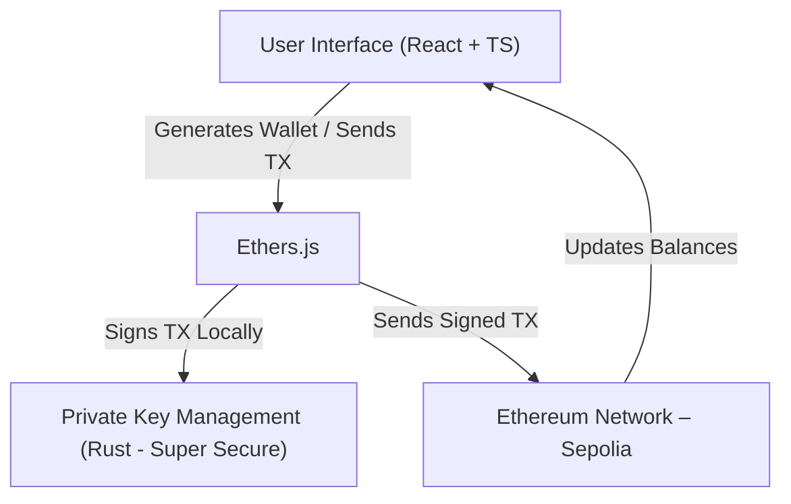

# Crypt7 Wallet – MVP  

Crypt7 is a **non-custodial Ethereum wallet MVP** that allows users to create wallets, manage tokens, and performs transactions — all in a simple, secure, and developer-friendly way.  

---

## Features  
- **Ethereum Wallet Creation** – Generate new Ethereum wallets (private/public key pairs).  
- **Token Transactions** – Send and receive ERC-20 tokens easily.  
- **Non-Custodial** – Your private keys never leave your device.  
- **Minimal UI** – Focused on simplicity, perfect for testing and demos.  

---

## Tech Stack  
- **Frontend:** React + TypeScript  
- **Blockchain:** Ethereum (via Ethers.js)  
- **Backend:** Rust (for key management)  

---

## Project Architecture  

## License

This project is licensed under the MIT License.  

